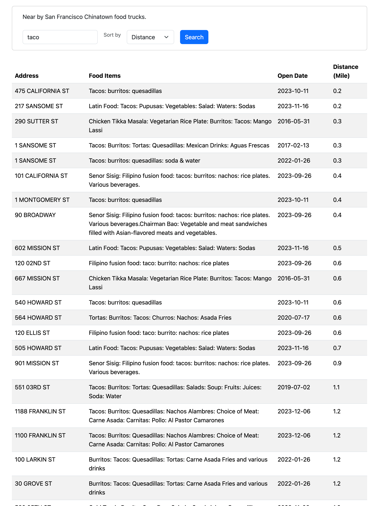

San Francisco's food truck
====
If you love to eat, this app will help you find San Francisco's food trucks.

**Screenshot**  


# Getting Started

## Dependencies
- Java 21

## Deploy in local

1. build
```shell
./gradlew build
```

In case you build fail, There has a compiled jar in `build/libs/app-server.jar`

2. start application in local
```shell
java -jar build/libs/app-server.jar
```

3. open website  
 [http://localhost:8080/index.html](http://localhost:8080/index.html), enjoy your exploration.

## Deploy in docker (Optional)

1. install Docker Desktop
> https://www.docker.com/products/docker-desktop/

2. build docker image
```shell
docker build -t foodtruck:v1 .
```

3. run container
```shell
docker run --name foodtruck  -p 8080:8080 -d foodtruck:v1
```
